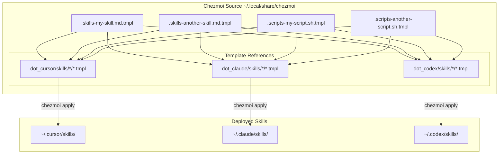

# Agent Skills Setup with Chezmoi

This document explains how Agent Skills are managed using chezmoi to maintain a single source of truth that deploys to multiple AI tools (Cursor, Claude, and Codex).

## Architecture Overview



## Directory Structure

### Source Templates (Single Source of Truth)

```
~/.local/share/chezmoi/
├── .skills-*.md.tmpl                # Skill definition templates
│   ├── .skills-my-skill.md.tmpl
│   └── .skills-another-skill.md.tmpl
├── .scripts-*.sh.tmpl               # Script templates
│   ├── .scripts-my-script.sh.tmpl
│   └── .scripts-another-script.py.tmpl
├── dot_cursor/skills/               # Cursor template references
│   ├── my-skill/
│   │   ├── SKILL.md.tmpl           # References .skills-my-skill.md.tmpl
│   │   └── scripts/
│   │       └── executable_my-script.sh.tmpl
│   └── another-skill/
│       ├── SKILL.md.tmpl
│       └── scripts/
│           └── executable_another-script.py.tmpl
├── dot_claude/skills/               # Claude template references (same structure)
└── dot_codex/skills/                # Codex template references (same structure)
```

### Deployed Skills (Identical Across Tools)

```
~/.cursor/skills/
~/.claude/skills/
~/.codex/skills/
└── Each contains:
    └── my-skill/
        ├── SKILL.md
        ├── scripts/
        │   ├── deploy.sh
        │   └── validate.py
        ├── references/
        │   └── REFERENCE.md
        └── assets/
            └── config-template.json
```

## How It Works

1. Skill definitions and scripts are stored once as hidden template files (`.skills-*.tmpl`, `.scripts-*.tmpl`)
2. Template reference files in `dot_cursor`, `dot_claude`, and `dot_codex` include the source templates
3. Running `chezmoi apply` renders templates and deploys identical copies to all three tools
4. All deployed files are verified to be identical using MD5 checksums

## Editing Skills

### Option 1: Edit in Chezmoi Source (Recommended)

Edit the template source files directly and deploy to all tools:

```bash
# Edit a skill definition
vim ~/.local/share/chezmoi/.skills-my-skill.md.tmpl

# Edit a script
vim ~/.local/share/chezmoi/.scripts-my-script.sh.tmpl

# Deploy changes to all three tools
chezmoi apply

# Verify deployment
md5 ~/.cursor/skills/my-skill/SKILL.md \
    ~/.claude/skills/my-skill/SKILL.md \
    ~/.codex/skills/my-skill/SKILL.md
```

### Option 2: Edit in Home Directory and Sync Back

If you edit a deployed skill file directly, sync it back to chezmoi:

```bash
# Edit a deployed file
vim ~/.cursor/skills/my-skill/SKILL.md

# Add the changed file back to chezmoi
chezmoi add ~/.cursor/skills/my-skill/SKILL.md

# This will update: ~/.local/share/chezmoi/dot_cursor/skills/my-skill/SKILL.md.tmpl

# Important: Copy the content to the source template
cp ~/.local/share/chezmoi/dot_cursor/skills/my-skill/SKILL.md.tmpl \
   ~/.local/share/chezmoi/.skills-my-skill.md.tmpl

# Deploy to ensure all tools are synced
chezmoi apply
```

Note: When using Option 2, you must manually update the source template file (`.skills-*.tmpl`) to maintain the single source of truth.

## Adding a New Skill

To add a new skill that deploys to all three tools:

```bash
cd ~/.local/share/chezmoi

# 1. Create the source template
vim .skills-my-new-skill.md.tmpl

# 2. Create template references for all three tools
for tool in cursor claude codex; do
    mkdir -p "dot_${tool}/skills/my-new-skill"
    echo '{{ include ".skills-my-new-skill.md.tmpl" }}' > \
        "dot_${tool}/skills/my-new-skill/SKILL.md.tmpl"
done

# 3. If the skill needs scripts, create script template and references
vim .scripts-my-script.sh.tmpl

for tool in cursor claude codex; do
    mkdir -p "dot_${tool}/skills/my-new-skill/scripts"
    echo '{{ include ".scripts-my-script.sh.tmpl" }}' > \
        "dot_${tool}/skills/my-new-skill/scripts/executable_my-script.sh.tmpl"
done

# 4. Deploy
chezmoi apply

# 5. Verify
ls -la ~/.cursor/skills/my-new-skill/ \
       ~/.claude/skills/my-new-skill/ \
       ~/.codex/skills/my-new-skill/
```

## Removing a Skill

To remove a skill from all tools:

```bash
cd ~/.local/share/chezmoi

# 1. Remove source templates
rm .skills-my-skill.md.tmpl
rm .scripts-my-script.sh.tmpl  # if applicable

# 2. Remove template references
rm -rf dot_cursor/skills/my-skill
rm -rf dot_claude/skills/my-skill
rm -rf dot_codex/skills/my-skill

# 3. Apply changes (removes from deployed locations)
chezmoi apply --force

# 4. Verify removal
ls ~/.cursor/skills/my-skill 2>/dev/null || echo "Removed from cursor"
ls ~/.claude/skills/my-skill 2>/dev/null || echo "Removed from claude"
ls ~/.codex/skills/my-skill 2>/dev/null || echo "Removed from codex"
```

## Verifying Consistency

To ensure all deployed skills are identical across tools:

```bash
# Check a specific skill
md5 ~/.cursor/skills/my-skill/SKILL.md \
    ~/.claude/skills/my-skill/SKILL.md \
    ~/.codex/skills/my-skill/SKILL.md

# Check a script
md5 ~/.cursor/skills/my-skill/scripts/my-script.sh \
    ~/.claude/skills/my-skill/scripts/my-script.sh \
    ~/.codex/skills/my-skill/scripts/my-script.sh

# If checksums differ, re-apply from source
chezmoi apply --force
```

## Troubleshooting

### Skills not appearing in AI tools

1. Verify deployment:
   ```bash
   ls -la ~/.cursor/skills/ ~/.claude/skills/ ~/.codex/skills/
   ```

2. Check chezmoi managed files:
   ```bash
   chezmoi managed | grep skills
   ```

3. Re-apply templates:
   ```bash
   chezmoi apply --force
   ```

### Template conflicts

If you see "inconsistent state" errors:

```bash
# Remove conflicting non-template files
cd ~/.local/share/chezmoi
rm dot_cursor/skills/*/SKILL.md  # Keep only .tmpl files

# Re-apply
chezmoi apply
```

### Script permissions

If scripts are not executable:

```bash
# In chezmoi source, script templates must be named with "executable_" prefix
# Example: executable_my-script.sh.tmpl

# To fix permissions on deployed files
chmod +x ~/.cursor/skills/*/scripts/*.sh
chmod +x ~/.claude/skills/*/scripts/*.sh
chmod +x ~/.codex/skills/*/scripts/*.sh
```

## Benefits of This Setup

1. Single Source of Truth: Edit once, deploy everywhere
2. Version Control: All skills are tracked in your chezmoi repository
3. Portability: Skills work across Cursor, Claude, and Codex
4. Consistency: Identical skills across all tools (verified with checksums)
5. Maintainability: Update skills without manual copying
6. Backup: Skills are preserved in your dotfiles repository

## Related Documentation

- Cursor Skills: https://cursor.com/docs/context/skills
- Claude Agent Skills: https://platform.claude.com/docs/en/agents-and-tools/agent-skills/overview
- Codex Skills: https://developers.openai.com/codex/skills
- Agent Skills Standard: https://agentskills.io
- Chezmoi Documentation: https://www.chezmoi.io/
