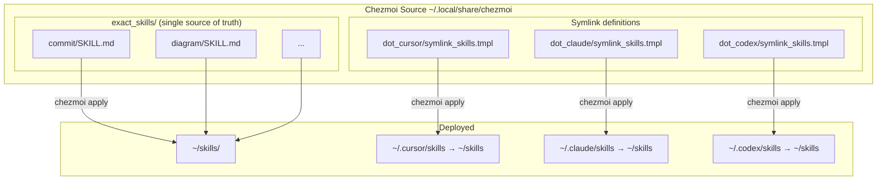

# Agent Skills Setup with Chezmoi

This file is deployed next to the `create-skill` skill as `references/skills-setup.md`. Upstream copy: https://github.com/dcwalker/TildeSlashDotAsterisk/blob/master/docs/skills-setup.md

This document explains how Agent Skills are managed using chezmoi to maintain a single source of truth that deploys to multiple AI tools (Cursor, Claude, and Codex).

## Architecture Overview



## Directory Structure

### Chezmoi Source

```
~/.local/share/chezmoi/
├── exact_skills/                    # Single source of truth for all skills
│   ├── commit/
│   │   └── SKILL.md
│   ├── diagram/
│   │   ├── SKILL.md
│   │   ├── choosing-diagram-tools-and-format.md
│   │   ├── design-guidelines-and-rules.md
│   │   └── scripts/
│   │       └── executable_wrap-graphviz-labels.py
│   └── ...
├── dot_cursor/
│   └── symlink_skills.tmpl          # Contains: {{ .chezmoi.homeDir }}/skills
├── dot_claude/
│   └── symlink_skills.tmpl          # Contains: {{ .chezmoi.homeDir }}/skills
└── dot_codex/
    └── symlink_skills.tmpl          # Contains: {{ .chezmoi.homeDir }}/skills
```

### Deployed (Identical Across Tools via Symlinks)

```
~/skills/                            # Canonical location (managed by chezmoi)
├── commit/
│   └── SKILL.md
├── diagram/
│   ├── SKILL.md
│   ├── choosing-diagram-tools-and-format.md
│   ├── design-guidelines-and-rules.md
│   └── scripts/
│       └── wrap-graphviz-labels.py
└── ...

~/.cursor/skills -> ~/skills         # Symlink
~/.claude/skills -> ~/skills         # Symlink
~/.codex/skills  -> ~/skills         # Symlink
```

## How It Works

1. Skill files are stored as plain files (not templates) in `exact_skills/<name>/`
2. Chezmoi deploys `exact_skills/` to `~/skills/`
3. Symlink definitions in each `dot_<tool>/symlink_skills.tmpl` create symlinks from each agent's skills directory to `~/skills/`
4. All three tools share the exact same files — no duplication, no syncing needed

## Editing Skills

Edit skills directly in the chezmoi source directory:

```bash
# Edit a skill
vim ~/.local/share/chezmoi/exact_skills/my-skill/SKILL.md

# Deploy changes
chezmoi apply

# All three tools see the change immediately via symlinks
```

If you edit a deployed file at `~/skills/my-skill/SKILL.md`, sync it back:

```bash
chezmoi add ~/skills/my-skill/SKILL.md
```

## Adding a New Skill

```bash
cd ~/.local/share/chezmoi

# 1. Create the skill directory with SKILL.md
mkdir -p exact_skills/my-new-skill
vim exact_skills/my-new-skill/SKILL.md

# 2. If the skill needs scripts, add them with executable_ prefix
mkdir -p exact_skills/my-new-skill/scripts
vim exact_skills/my-new-skill/scripts/executable_my-script.sh

# 3. Deploy
chezmoi apply

# 4. Verify
ls ~/skills/my-new-skill/
```

The `executable_` prefix is a chezmoi convention — chezmoi strips the prefix and sets the file as executable when deploying.

## Importing Existing Skills

The `import-skills.py` script automates importing skills from the filesystem into the chezmoi source:

```bash
# Scan home directory and current working directory
import-skills.py

# Also scan an additional directory
import-skills.py --scan-dir /path/to/project

# Preview without making changes
import-skills.py --dry-run
```

The script copies skill files directly into `exact_skills/<name>/`, adding the `executable_` prefix to scripts as needed.

## Removing a Skill

```bash
cd ~/.local/share/chezmoi

# Remove the skill directory
rm -rf exact_skills/my-skill

# Apply (the exact_ prefix ensures chezmoi removes it from ~/skills/)
chezmoi apply
```

## Script Permissions

Scripts in chezmoi source must use the `executable_` filename prefix:

```
exact_skills/my-skill/scripts/executable_my-script.sh
```

Chezmoi deploys this as `~/skills/my-skill/scripts/my-script.sh` with executable permissions.

## Troubleshooting

### Skills not appearing in AI tools

1. Verify symlinks exist:
   ```bash
   ls -la ~/.cursor/skills ~/.claude/skills ~/.codex/skills
   # All should show -> /Users/<you>/skills
   ```

2. Verify skills are deployed:
   ```bash
   ls ~/skills/
   ```

3. Re-apply:
   ```bash
   chezmoi apply
   ```

### Trello skills

Trello-tools skills are symlinked into `~/skills/` by `run_after_symlink-trello-skills.sh`. The `exact_` prefix on `exact_skills/` means chezmoi removes unmanaged entries on apply, but the `run_after_` script recreates the trello symlinks after each apply.

## Benefits of This Setup

1. **Single Source of Truth**: One copy of each skill in `exact_skills/`
2. **No Duplication**: Symlinks mean all tools share the same files
3. **Simple Editing**: Plain files, no templates — edit directly
4. **Version Control**: All skills tracked in the chezmoi repository
5. **Portability**: Skills work across Cursor, Claude, and Codex
6. **Easy Maintenance**: Add a skill in one place, all tools see it

## Related Documentation

- Cursor Skills: https://cursor.com/docs/context/skills
- Claude Agent Skills: https://platform.claude.com/docs/en/agents-and-tools/agent-skills/overview
- Codex Skills: https://developers.openai.com/codex/skills
- Agent Skills Standard: https://agentskills.io
- Chezmoi Documentation: https://www.chezmoi.io/
